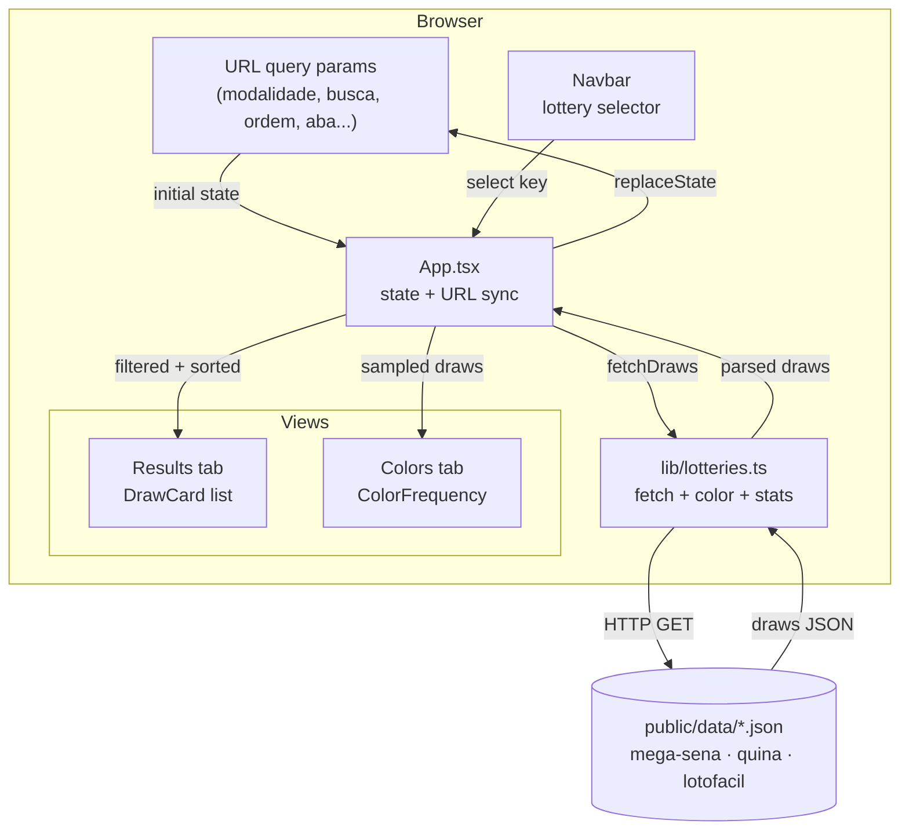
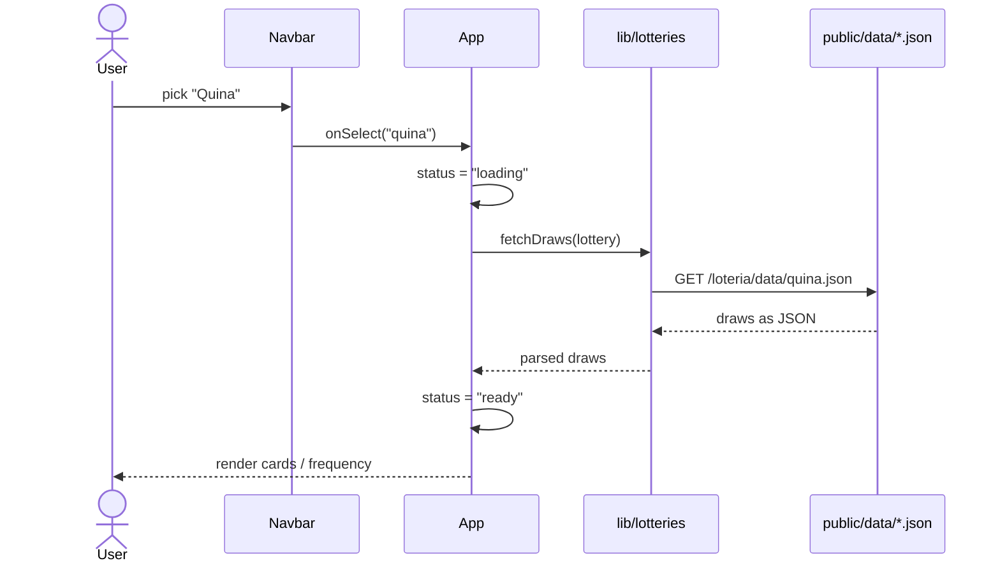
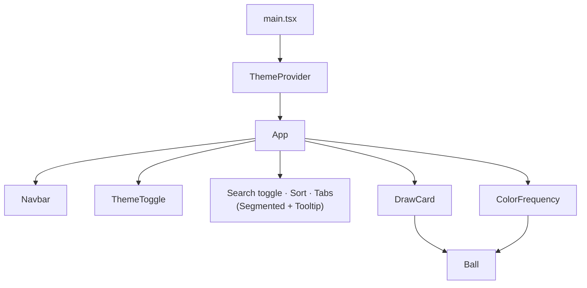
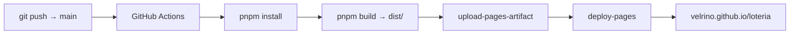

# Loteria

A fast, mobile-first browser for Brazilian lottery results (**Mega-Sena**,
**Quina** and **Lotofácil**). It loads every historical draw from static JSON
assets and lets you search, sort and analyse the draws — including the official
ball-color frequency breakdown for Mega-Sena and Quina.

Built with **React + TypeScript**, **Vite**, **Tailwind CSS** and **shadcn/ui**,
with light/dark/system themes. Fully static — no backend.

🔗 **Live:** https://velrino.github.io/loteria/

---

## Features

- **Three lotteries** in one place — switch from the navbar selector.
- **All draws** loaded from bundled JSON (3k–7k concursos per game).
- **Search** by concurso number or by drawn numbers (dezenas); the input only
  accepts digits.
- **Sort** ascending / descending by concurso.
- **Colored balls** following the official units-digit color pattern
  (Mega-Sena & Quina).
- **Color frequency** tab — how often each color appears, with percentage bars
  and a configurable sample size (last N draws).
- **Per-draw stats** — even / odd / sum.
- **Shareable state** — search, sort, tab and sample are mirrored to the URL.
- **Mobile-first & accessible** — large tap targets, segmented controls,
  tooltips, ARIA labels.

---

## Tech stack

| Layer       | Choice                                  |
| ----------- | --------------------------------------- |
| Framework   | React 19 + TypeScript                   |
| Build tool  | Vite 7                                  |
| Styling     | Tailwind CSS 3 + shadcn/ui primitives   |
| Icons       | lucide-react                            |
| Package mgr | pnpm                                    |
| Hosting     | GitHub Pages (static)                   |

---

## Architecture

The app is a single client-side React tree. On every lottery change it fetches
the matching JSON from `public/data/`, then filtering, sorting and color
analysis happen in memory.



### Data loading sequence



### Component tree



---

## Data model

Each JSON file is an array of draws:

```ts
type Draw = {
  concurso: number;   // draw number, e.g. 3017
  data: string;       // date "dd/mm/yyyy"
  dezenas: number[];  // drawn numbers, ascending
  situacao: string;   // official status text (not shown in UI)
};
```

| Lottery   | File              | Range | Colored balls |
| --------- | ----------------- | ----- | ------------- |
| Mega-Sena | `mega-sena.json`  | 1–60  | ✅            |
| Quina     | `quina.json`      | 1–80  | ✅            |
| Lotofácil | `lotofacil.json`  | 1–25  | ❌            |

### Ball color pattern

For Mega-Sena and Quina the ball color is determined by the **units digit** of
the number (`dezena % 10`):

| Digit | Color (PT) | Examples              |
| ----- | ---------- | --------------------- |
| 1     | Vermelha   | 01, 11, 21, 31, …     |
| 2     | Amarela    | 02, 12, 22, 32, …     |
| 3     | Verde      | 03, 13, 23, 33, …     |
| 4     | Marrom     | 04, 14, 24, 34, …     |
| 5     | Azul       | 05, 15, 25, 35, …     |
| 6     | Rosa       | 06, 16, 26, 36, …     |
| 7     | Preta      | 07, 17, 27, 37, …     |
| 8     | Cinza      | 08, 18, 28, 38, …     |
| 9     | Laranja    | 09, 19, 29, 39, …     |
| 0     | Branca     | 10, 20, 30, 40, …     |

The **Colors** tab aggregates, across the selected sample, how many draws
contained 0, 1, 2, … balls of each color, shown as counts and percentage bars.

---

## Getting started

Requirements: **Node 22+** and **pnpm 10+**.

```bash
pnpm install      # install dependencies
pnpm dev          # start the dev server (http://localhost:5173/loteria/)
pnpm build        # type-check (tsc -b) + production build to dist/
pnpm preview      # preview the production build locally
pnpm lint         # run ESLint
```

> The Vite `base` is set to `/loteria/`, so the dev server and built app are
> served under that path.

---

## Project structure

```
loteria/
├── public/
│   └── data/                  # bundled lottery datasets (static assets)
│       ├── mega-sena.json
│       ├── quina.json
│       └── lotofacil.json
├── src/
│   ├── App.tsx                # page, state, URL sync, filtering/sorting
│   ├── main.tsx               # React root + ThemeProvider
│   ├── index.css              # Tailwind layers + theme tokens
│   ├── lib/
│   │   ├── lotteries.ts       # config, fetch, color map, stats, frequency
│   │   └── utils.ts           # cn() class merge helper
│   └── components/
│       ├── navbar.tsx         # fixed top bar + lottery selector
│       ├── draw-card.tsx      # one concurso card (balls + stats + colors)
│       ├── color-frequency.tsx# per-color distribution with bars
│       ├── ball.tsx           # single colored/neutral number ball
│       ├── theme-provider.tsx # light/dark/system theme context
│       ├── theme-toggle.tsx   # floating theme button
│       └── ui/                # shadcn-style primitives
│           ├── button.tsx
│           ├── badge.tsx
│           ├── card.tsx
│           ├── segmented.tsx  # minimal segmented control
│           └── tooltip.tsx    # CSS-only tooltip
└── .github/workflows/deploy.yml
```

---

## Deployment

Pushing to `main` triggers the **GitHub Pages** workflow
(`.github/workflows/deploy.yml`): it installs with pnpm, runs `pnpm build`, and
publishes the `dist/` artifact.


